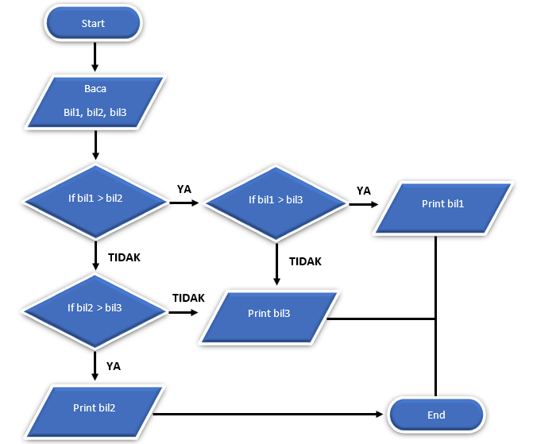
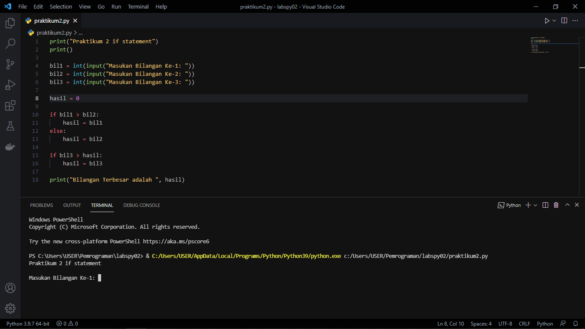
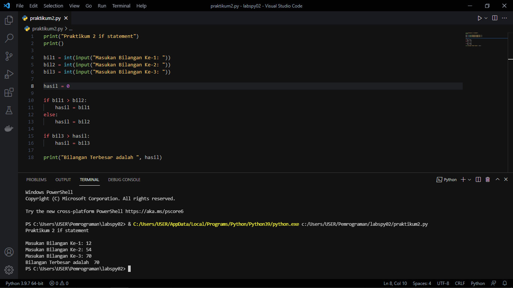

# Labspy02
## Program Menentukan Bilangan Terbesar, dengan Tiga buah Bilangan

- ALGORITMA:
```bash 
read(bil1, bil2, bil3)
if bil1 > bil2 then
   hasil ← bil1
else
   hasil ← bil2
end if

if hasil < bil3 then
   hasil ← bil3
end if

write("Bilangan Terbesar adalah", hasil)
```
- FLOWCHART



- KONDISI



